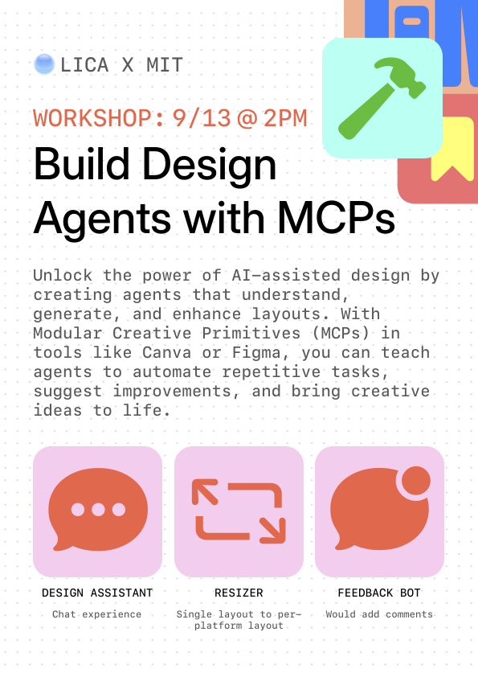
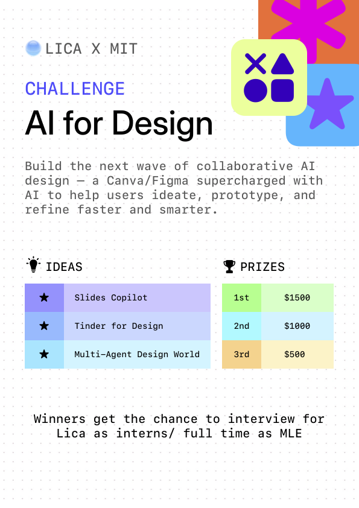

# LICA at HackMIT

Welcome to **LICA @ HackMIT**! 🎉

We're hosting:

* 🛠️ **Workshop** – Learn about MCPs for graphic design.
* 🎯 **Challenge** – Put your skills to the test and compete for fun prizes.

Looking forward to seeing your cool hacks — may your commits be bug-free and your coffee supply infinite ☕⚡.

<p align="center">
  
  
</p>

## Quick Start

### Running Both Services with Docker Compose

The easiest way to get started is to run both the MCP server and assistant together using Docker Compose:

1. **Clone the repository:**
```bash
git clone <repository-url>
cd DesignMCP
```

2. **Set up environment variables:**
```bash
# Create environment files for both services
cp mcp-server/.env.example mcp-server/.env
cp mcp-assistant/.env.example mcp-assistant/.env

# Edit the files with your API keys
nano mcp-server/.env
nano mcp-assistant/.env
```

3. **Run both services:**
```bash
docker compose up -d
```

4. **Access the applications:**
- **MCP Server**: http://localhost:8000
- **MCP Assistant**: http://localhost:8501

### Individual Service Setup

For detailed setup instructions for each service, see:
- [MCP Server README](./mcp-server/README.md)
- [MCP Assistant README](./mcp-assistant/README.md)

### Development

For development with live code reloading:

```bash
# Run in development mode with volume mounting
docker compose -f docker-compose.dev.yml up -d
```

### Useful Docker Commands

```bash
# View logs
docker compose logs -f

# Stop services
docker compose down

# Rebuild and restart
docker compose up -d --build

# View running containers
docker compose ps

# Execute commands in containers
docker compose exec mcp-server bash
docker compose exec mcp-assistant bash
```

## Project Structure

```
DesignMCP/
├── mcp-server/          # MCP server with AI tools
├── mcp-assistant/       # Streamlit assistant interface
├── MCP-workshop/        # Workshop materials
├── docker-compose.yml   # Docker Compose for both services
└── README.md
```

## License

This project is created for educational purposes as part of the LICA @ HackMIT workshop. 

**For Workshop Participants:**
- You are free to use, modify, and distribute this code for educational and learning purposes
- Feel free to experiment, build upon, and create derivative works
- Attribution to the original authors is appreciated but not required
- This code is provided "as is" without any warranties

**For Commercial Use:**
- Please contact the Lica team for commercial licensing terms
- Commercial use requires explicit permission

This workshop material is designed to help you learn about Model Context Protocols (MCPs) and AI-powered multimedia generation. Happy coding! 🚀
